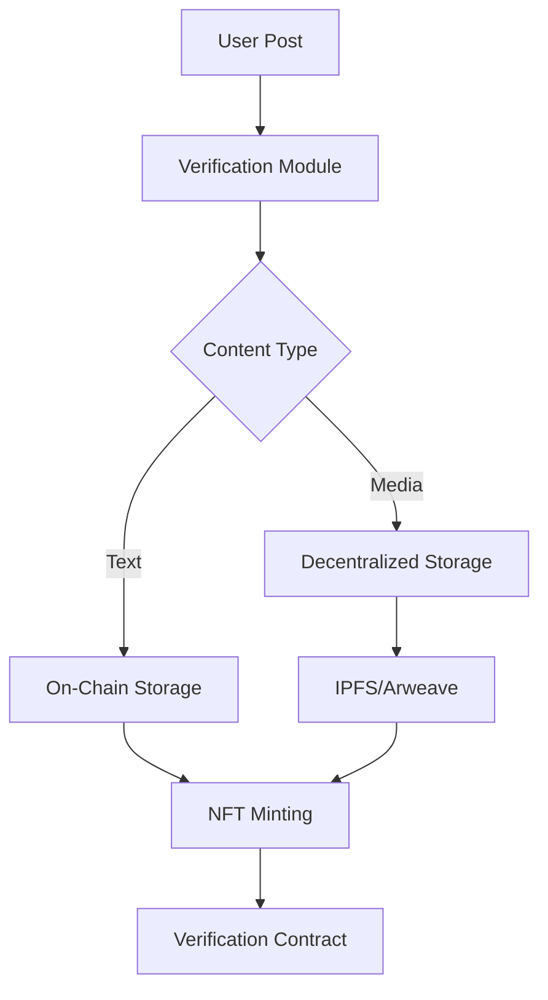
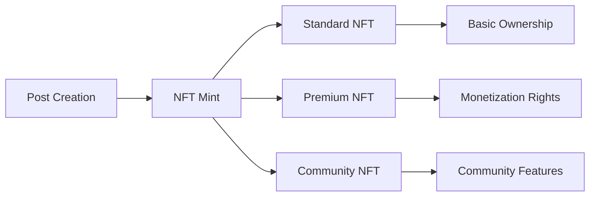
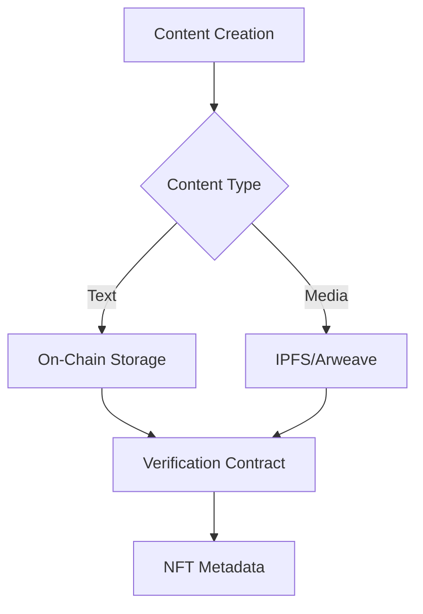

# SOLspace Technical Architecture: Content Verification & Ownership System

## Core Components

### 1. Content Verification Layer



#### Verification Process:

- Each post generates a unique hash incorporating:
  - Content hash
  - Timestamp
  - Creator signature
  - Parent references (for replies/shares)
- Media content stored on IPFS/Arweave with content-addressable hashes
- Text content stored directly on-chain for immediate verification
- Smart contract validates authenticity and ownership chain

### 2. NFT Architecture



#### NFT Types & Properties:

- **Standard NFTs**: Every post
  - Ownership proof
  - Engagement history
  - Transfer rights
- **Premium NFTs**: Exclusive content

  - Access control
  - Revenue sharing
  - Secondary market rights

- **Community NFTs**: Interactive content
  - Tipping enabled
  - Reward distribution
  - Governance rights

### 3. Smart Contract Infrastructure

```typescript
interface ContentVerification {
  contentHash: string;
  timestamp: number;
  creatorSignature: string;
  parentRefs?: string[];
  engagementMetrics: {
    likes: number;
    shares: number;
    comments: number;
  };
  verificationStatus: VerificationLevel;
}

enum VerificationLevel {
  BASIC, // Standard post
  VERIFIED, // Creator verified
  PREMIUM, // Premium content
  COMMUNITY, // Community-verified
}
```

#### Key Contract Functions:

1. Content Verification
2. Ownership Management
3. Engagement Tracking
4. Revenue Distribution
5. Access Control

### 4. Storage Architecture



#### Storage Strategy:

- Text content: On-chain for immediate verification
- Media content: IPFS/Arweave with hash references
- Metadata: Hybrid approach for scalability
- Engagement data: Layer 2 with periodic settlement

### 5. Verification Algorithm

```typescript
async function verifyContent(content: Content): Promise<VerificationStatus> {
  // Generate content hash
  const contentHash = await generateContentHash(content);

  // Verify creator signature
  const isSignatureValid = await verifyCreatorSignature(
    content.signature,
    contentHash
  );

  // Check reference integrity
  const areReferencesValid = await validateReferences(content.parentRefs);

  // Verify timestamp
  const isTimestampValid = await validateTimestamp(content.timestamp);

  // Check engagement metrics
  const areMetricsValid = await validateEngagementMetrics(
    content.id,
    content.metrics
  );

  return {
    isValid:
      isSignatureValid &&
      areReferencesValid &&
      isTimestampValid &&
      areMetricsValid,
    verificationLevel: determineVerificationLevel(content),
    timestamp: Date.now(),
    verifier: CONTRACT_ADDRESS,
  };
}
```

## Security Features

1. **Signature Verification**

   - ECDSA signatures for content authenticity
   - Multi-sig for premium content
   - Timestamp validation

2. **Reference Integrity**

   - Parent post verification
   - Chain of ownership validation
   - Engagement proof verification

3. **Spam Prevention**

   - Stake-based posting
   - Rate limiting
   - Community validation

4. **Privacy Protection**
   - Zero-knowledge proofs for private content
   - Encrypted metadata
   - Selective disclosure
