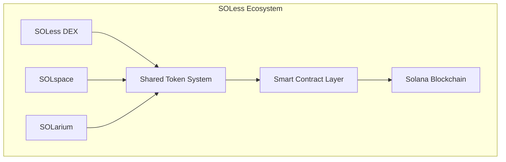
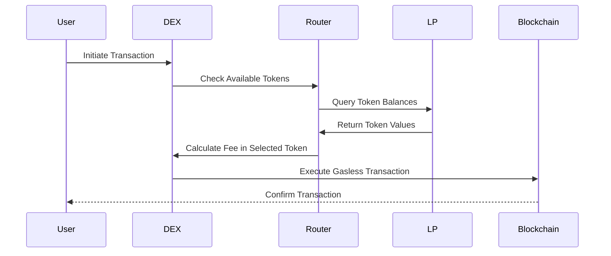
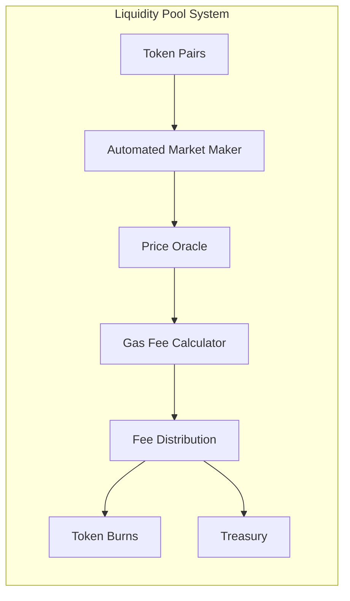
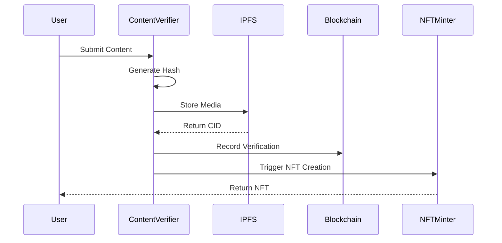
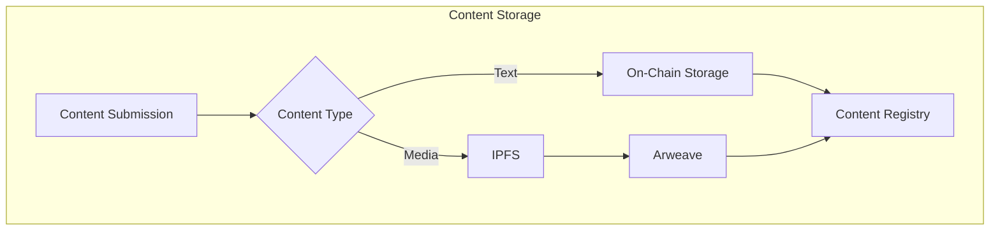
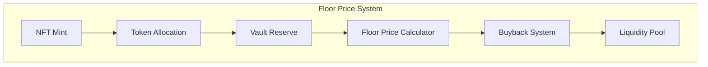
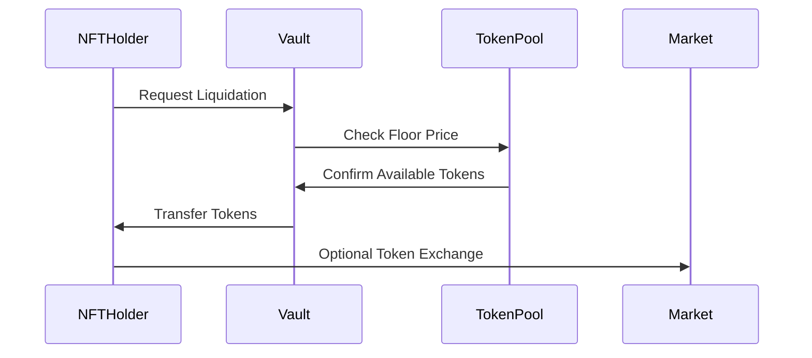
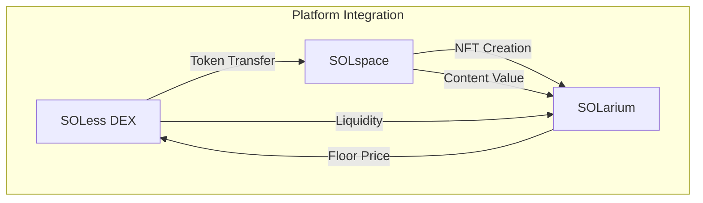

# SOLess System Technical Architecture

## System Overview



## 1. SOLess DEX Architecture

### 1.1 Gasless Transaction System



### 1.2 Smart Contract Infrastructure

```solidity
contract SOLessRouter {
    struct GaslessTransaction {
        address user;
        address tokenIn;
        address tokenOut;
        uint256 amountIn;
        uint256 amountOut;
        uint256 gasFee;
        address feeToken;
    }
    
    mapping(address => mapping(address => uint256)) public tokenAllowances;
    mapping(address => uint256) public userNonces;
    
    function executeGaslessSwap(
        GaslessTransaction memory transaction,
        bytes memory signature
    ) external returns (bool) {
        require(verifySignature(transaction, signature), "Invalid signature");
        // Swap implementation
    }
}
```

### 1.3 Liquidity Pool Structure



## 2. SOLspace Architecture

### 2.1 Content Verification Flow



### 2.2 Storage Architecture



### 2.3 Verification Smart Contract

```solidity
contract ContentVerification {
    struct Content {
        bytes32 contentHash;
        uint256 timestamp;
        address creator;
        bytes signature;
        bytes32[] parentRefs;
        ContentType contentType;
        VerificationStatus status;
    }
    
    enum ContentType {
        TEXT,
        IMAGE,
        VIDEO,
        AUDIO
    }
    
    mapping(bytes32 => Content) public verifiedContent;
    mapping(address => uint256) public creatorScores;
}
```

## 3. SOLarium Architecture

### 3.1 Floor Price Mechanism



### 3.2 NFT Vault Structure

```solidity
contract SOLariumVault {
    struct NFTDetails {
        uint256 tokenId;
        uint256 floorPrice;
        uint256 lockedTokens;
        uint256 lastValuation;
        address creator;
    }
    
    mapping(uint256 => NFTDetails) public nftVault;
    mapping(address => uint256) public creatorVaults;
    
    function calculateFloorPrice(uint256 tokenId) public view returns (uint256) {
        // Floor price calculation logic
    }
}
```

### 3.3 Liquidity Process



## 4. Integration Points

### 4.1 Cross-Platform Communication


