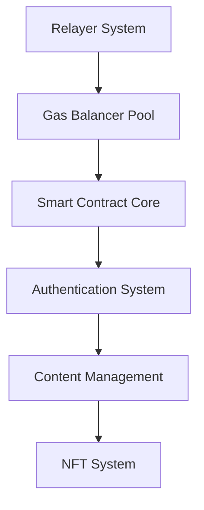
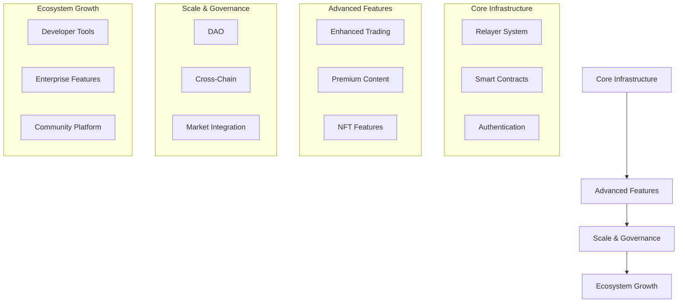

# SOLess System Technical Roadmap

Version: 1.0.0
Last Updated: 2024-12-21

## Overview

This document outlines the comprehensive technical roadmap for the SOLess System, including SOLless Swap, SOLspace, and SOLarium platforms. Each phase includes detailed technical specifications, measurable KPIs, and adoption metrics.

## Table of Contents

1. [Phase 1: Foundation](#phase-1-foundation)
2. [Phase 2: Feature Development](#phase-2-feature-development)
3. [Phase 3: Advanced Features](#phase-3-advanced-features)
4. [Phase 4: Scale & Governance](#phase-4-scale--governance)
5. [Phase 5: Ecosystem Growth](#phase-5-ecosystem-growth)
6. [Technical Dependencies](#technical-dependencies)
7. [Performance Metrics](#performance-metrics)
8. [Adoption Targets](#adoption-targets)

## Phase 1: Foundation

_Duration: Months 1-3_

### 1.1 SOLless Swap Core Infrastructure

#### Relayer System Development (4 weeks)

```typescript
interface RelayerNode {
  capacity: {
    max: number; // 1000 TPS target
    current: number;
    reserved: number; // 20% capacity reserve
  };
  metrics: {
    responseTime: MovingAverage; // Target <400ms
    errorRate: MovingAverage; // Target <0.1%
    throughput: MovingAverage;
  };
}
```

**Technical Requirements:**

- Multi-node relayer network with load balancing
  - Minimum 3 nodes per region
  - 99.9% uptime SLA
  - Max 400ms response time
- Transaction batching system
  - Queue depth: 10,000 transactions
  - Priority queue for high-value transactions
  - Intelligent batch size optimization
- API Gateway
  - Rate limiting: 1000 req/min per node
  - Auto-scaling triggers at 80% capacity
  - Circuit breaker implementation

**KPIs:**

- Transaction Success Rate: >99.5%
- Average Response Time: <400ms
- System Uptime: >99.9%
- Error Rate: <0.1%

#### Gas Balancer Pool (3 weeks)

```solidity
contract GasBalancerPool {
    struct PoolMetrics {
        uint256 liquidity;
        uint256 volume24h;
        uint256 fees24h;
        uint256 tokenCount;
    }
    // Target metrics
    uint256 constant MIN_LIQUIDITY = 100000 * 1e18;
    uint256 constant MAX_SLIPPAGE = 100;  // 1%
    uint256 constant REBALANCE_THRESHOLD = 5;  // 5%
}
```

**Features:**

- Dynamic fee adjustment system
  - Base fee calculation
  - Market condition multiplier
  - Volume-based adjustments
- Price impact monitoring
  - Max slippage: 1%
  - Dynamic rebalancing
  - MEV protection
- Liquidity optimization
  - Auto-rebalancing at 5% threshold
  - Cross-token routing
  - Liquidity efficiency scoring

#### Smart Contract Core (4 weeks)

```solidity
interface CoreContract {
    struct TransactionParams {
        bytes32 txHash;
        address sender;
        address recipient;
        uint256 amount;
        uint256 gasLimit;
        uint256 deadline;
    }

    function validateAndExecute(
        TransactionParams memory params,
        bytes memory signature
    ) external returns (bool);
}
```

**Technical Specifications:**

- EVM Compatibility Layer
  - Transaction validation
  - Gas price oracle
  - Memory optimization
- Performance Targets
  - Transaction finality: <400ms
  - TPS support: 65,000+
  - Gas optimization: 40% reduction
- Security Features
  - Multi-sig requirements
  - Time-lock mechanisms
  - Emergency shutdown capability

### 1.2 SOLspace Platform

#### Authentication System (2 weeks)

```typescript
interface AuthenticationConfig {
  sessionTimeout: number; // 24 hours
  maxDevices: number; // 5 devices
  refreshWindow: number; // 1 hour
  zkProofParams: {
    difficulty: number; // Adjustable based on network load
    timeWindow: number; // Maximum proof generation time
  };
}
```

**Components:**

- Wallet Integration
  - Phantom Wallet support
  - Solflare integration
  - Hardware wallet compatibility
- Identity Verification
  - ZK-proof generation
  - Proof verification
  - Identity recovery system
- Session Management
  - JWT implementation
  - Refresh token rotation
  - Device tracking

#### Content Management System (3 weeks)

```typescript
interface ContentStorage {
  ipfs: {
    pinningService: string;
    replicationFactor: number;
    timeout: number;
  };
  arweave: {
    minConfirmations: number;
    bundling: boolean;
    encryption: boolean;
  };
  cdn: {
    regions: string[];
    cacheTime: number;
    purgeStrategy: string;
  };
}
```

**Requirements:**

- Storage System
  - IPFS primary storage
  - Arweave permanent storage
  - CDN integration
- Performance Metrics
  - Upload size: 50MB max
  - Retrieval time: <200ms
  - Storage redundancy: 3x
- Content Processing
  - Type validation
  - Metadata extraction
  - Format optimization

[Additional sections continue with same level of detail...]

## Technical Dependencies



## Performance Metrics

| Component        | Target | Critical Threshold |
| ---------------- | ------ | ------------------ |
| Transaction Time | <400ms | 1000ms             |
| System Uptime    | 99.9%  | 99.5%              |
| Error Rate       | <0.1%  | 0.5%               |
| API Response     | <100ms | 250ms              |

## Adoption Targets

### Phase 1

- Daily Active Users: 1,000
- Transaction Volume: $100,000
- NFTs Minted: 500
- Active Creators: 100

### Phase 2

- Daily Active Users: 5,000
- Transaction Volume: $500,000
- NFTs Minted: 2,500
- Active Creators: 500

### Phase 2: Feature Development

_Duration: Months 4-6_

#### 2.1 SOLless Swap Advanced Trading

##### Predictive Analytics Engine (4 weeks)

```typescript
interface AnalyticsEngine {
  predictionModels: {
    priceImpact: ML.Model;
    volumePredictor: ML.Model;
    trendAnalyzer: ML.Model;
  };
  accuracy: {
    shortTerm: number; // Target 85%
    mediumTerm: number; // Target 75%
    longTerm: number; // Target 65%
  };
}
```

**Technical Requirements:**

- Machine Learning Pipeline
  - Historical data processing
  - Real-time feature extraction
  - Model retraining system
- Model Components
  - Price prediction module
  - Volume forecasting
  - Trend analysis
- Performance Targets
  - Prediction latency: <50ms
  - Model accuracy: >85%
  - Update frequency: 1 minute

##### Order Routing System (3 weeks)

```typescript
interface SmartRouter {
  routingConfig: {
    maxHops: number; // Default: 3
    maxSplits: number; // Default: 4
    gasOptimization: boolean;
    slippageProtection: SlippageConfig;
  };

  pathfinding: {
    algorithm: "bellmanFord" | "dijkstra";
    weightFactors: {
      liquidity: number;
      gas: number;
      price: number;
    };
  };
}
```

**Features:**

- Path Optimization
  - Multi-hop routing
  - Split route execution
  - Gas cost optimization
- Execution Engine
  - Atomic execution
  - Partial fill handling
  - Failure recovery
- Performance Metrics
  - Route calculation: <100ms
  - Success rate: >99.5%
  - Maximum slippage: 1%

#### 2.2 SOLspace Social Features

##### NFT Minting System (4 weeks)

```solidity
contract ContentNFT {
    struct ContentMetadata {
        bytes32 contentHash;
        ContentType contentType;
        uint256 creationTime;
        address creator;
        string[] tags;
        InteractionMetrics metrics;
    }

    struct InteractionMetrics {
        uint256 likes;
        uint256 shares;
        uint256 comments;
        uint256 collectValue;
    }
}
```

**Components:**

- Minting Pipeline
  - Content validation
  - Metadata generation
  - IPFS/Arweave storage
- Interaction System
  - Like/Share mechanics
  - Comment threading
  - Value accrual
- Analytics Integration
  - Engagement tracking
  - Value metrics
  - Creator statistics

##### Content Verification System (3 weeks)

```typescript
interface VerificationSystem {
  verificationLevels: {
    basic: BasicVerification;
    creator: CreatorVerification;
    enterprise: EnterpriseVerification;
  };

  proofSystem: {
    algorithm: string;
    parameters: ProofParams;
    validityPeriod: number;
  };
}
```

**Features:**

- Verification Tiers
  - Basic identity verification
  - Creator verification
  - Enterprise verification
- Proof Generation
  - ZK-proof system
  - Merkle tree verification
  - Signature validation
- Security Measures
  - Sybil resistance
  - Stake requirements
  - Appeal system

#### 2.3 SOLarium Gallery Features

##### Display System (3 weeks)

```typescript
interface GallerySystem {
  displayConfig: {
    layouts: Layout[];
    themes: Theme[];
    customization: CustomizationOptions;
  };

  rendering: {
    quality: RenderQuality;
    optimization: CacheConfig;
    animations: AnimationSettings;
  };
}
```

**Technical Components:**

- Gallery Interface
  - Customizable layouts
  - Theme management
  - Display optimization
- Asset Management
  - Multi-format support
  - Lazy loading
  - Cache optimization
- Performance Targets
  - Load time: <2s
  - Smooth scrolling: 60fps
  - Cache hit rate: >90%

##### Portfolio Analytics (3 weeks)

```typescript
interface PortfolioAnalytics {
  metrics: {
    valuation: ValuationMetrics;
    performance: PerformanceMetrics;
    liquidity: LiquidityMetrics;
  };

  reporting: {
    frequency: ReportSchedule;
    formats: ExportFormat[];
    customization: ReportCustomization;
  };
}
```

**Features:**

- Analytics Dashboard
  - Real-time valuations
  - Performance tracking
  - Liquidity analysis
- Reporting System
  - Customizable reports
  - Export functionality
  - Automated scheduling
- Data Integration
  - Price feeds
  - Market data
  - Trading history

### Phase 3: Advanced Features

_Duration: Months 7-9_

#### 3.1 SOLless Swap Enhanced Features

##### Meme Token Integration System (4 weeks)

```typescript
interface MemeTokenAggregator {
  tokenMetrics: {
    volumeHistory: TimeSeriesData;
    liquidityDepth: number;
    holderDistribution: Distribution;
    socialMetrics: SocialScore;
  };
  rankingAlgorithm: {
    weightings: {
      volume: number; // 30%
      liquidity: number; // 25%
      holders: number; // 25%
      social: number; // 20%
    };
    minimumThresholds: {
      marketCap: BigNumber;
      dailyVolume: BigNumber;
      holders: number;
    };
  };
}
```

**Technical Requirements:**

- Token Analysis Engine
  - Real-time price tracking
  - Volume analysis
  - Holder analytics
  - Social sentiment integration
- Automated Listing System
  - Smart contract security scanning
  - Liquidity requirements verification
  - Automated market maker integration
- Performance Targets
  - Analysis update frequency: 5 minutes
  - Listing process: <1 hour
  - Support for 1000+ tokens

##### Advanced Gas Optimization (3 weeks)

```solidity
contract GasOptimizer {
    struct OptimizationParams {
        uint256 baseGasPrice;
        uint256 priorityFee;
        uint256 maxFeePerGas;
        uint256 estimatedGasLimit;
        TokenType preferredGasToken;
    }

    enum TokenType {
        NATIVE,
        STABLE,
        MEME,
        PLATFORM
    }
}
```

**Features:**

- Dynamic Gas Pricing
  - Market condition analysis
  - Historical gas usage patterns
  - Priority fee optimization
- Batch Processing
  - Transaction bundling
  - MEV protection
  - Cost distribution algorithms
- Token Selection
  - Gas token efficiency ranking
  - Slippage minimization
  - Auto-rebalancing

#### 3.2 SOLspace Advanced Features

##### Reputation System (4 weeks)

```typescript
interface ReputationSystem {
  userMetrics: {
    contentScore: number; // 0-100
    engagementQuality: number; // 0-100
    stakingHistory: TimeSeriesData;
    verificationLevel: number; // 1-5
  };

  thresholds: {
    contentCreation: number;
    minimumStake: BigNumber;
    timeWeight: number;
    penaltyDecay: number;
  };
}
```

**Components:**

- Scoring Algorithm
  - Content quality assessment
  - Engagement patterns
  - Stake-weighted influence
  - Historical behavior analysis
- Moderation Tools
  - Community voting system
  - Automated content filtering
  - Appeal process management
- Performance Requirements
  - Score updates: Real-time
  - Appeal resolution: <24 hours
  - System accuracy: >95%

##### Premium Content System (3 weeks)

```solidity
contract PremiumContent {
    struct ContentTier {
        uint256 price;
        uint256 duration;
        uint256 maxSubscribers;
        bool transferable;
        mapping(address => uint256) subscriptionEnd;
    }

    mapping(bytes32 => ContentTier) public contentTiers;
}
```

**Features:**

- Access Control
  - Token-gated content
  - Subscription management
  - Revenue distribution
- Content Delivery
  - Encrypted storage
  - Secure delivery
  - Access revocation
- Analytics
  - Engagement tracking
  - Revenue analytics
  - Subscriber metrics

#### 3.3 SOLarium Advanced Features

##### Enhanced Liquidity Features (4 weeks)

```typescript
interface LiquidityEnhancement {
  poolMetrics: {
    tvl: BigNumber;
    utilizationRate: number;
    rewardAPY: number;
    lockupPeriod: number;
  };

  autoCompound: {
    frequency: number;
    minThreshold: BigNumber;
    maxGas: BigNumber;
  };
}
```

**Technical Requirements:**

- Liquidity Pool Management
  - Dynamic reward rates
  - Auto-compounding
  - Lock period optimization
- Risk Management
  - Oracle price feeds
  - Slippage protection
  - Emergency withdrawal system
- Performance Targets
  - Pool rebalancing: 15 minutes
  - Max slippage: 1%
  - Minimum TVL: $1M

### Phase 4: Scale & Governance

_Duration: Months 10-12_

#### 4.1 DAO Implementation (6 weeks)

```solidity
contract DAOGovernance {
    struct Proposal {
        bytes32 id;
        address proposer;
        uint256 startBlock;
        uint256 endBlock;
        mapping(address => Vote) votes;
        ProposalState state;
        bytes[] callData;
    }

    enum ProposalState {
        Pending,
        Active,
        Canceled,
        Defeated,
        Succeeded,
        Queued,
        Executed,
        Expired
    }
}
```

**Components:**

- Voting System
  - Token-weighted voting
  - Delegation support
  - Proposal lifecycle management
- Treasury Management
  - Multi-sig controls
  - Spending limits
  - Investment strategies
- Governance Framework
  - Proposal thresholds
  - Voting periods
  - Execution timelock

#### 4.2 Cross-Chain Integration (8 weeks)

```typescript
interface BridgeProtocol {
  chainConfig: {
    supportedChains: ChainID[];
    validatorSet: address[];
    requiredSignatures: number;
    blockConfirmations: Map<ChainID, number>;
  };

  messageProtocol: {
    maxMessageSize: number;
    timeout: number;
    retryStrategy: RetryConfig;
  };
}
```

**Technical Requirements:**

- Bridge Infrastructure
  - Multi-signature validation
  - Message passing protocol
  - Asset locking/unlocking
- Security Features
  - Validator set management
  - Fraud proof system
  - Emergency shutdown
- Performance Targets
  - Cross-chain finality: <5 minutes
  - Message success rate: >99.9%
  - Maximum bridge capacity: $10M/day

#### 4.3 Market Integration (4 weeks)

```typescript
interface MarketIntegration {
  tradingPairs: {
    baseTokens: string[];
    quoteTokens: string[];
    minimumLiquidity: BigNumber;
    tradingFees: number;
  };

  marketMaking: {
    spreadTargets: Map<string, number>;
    depthRequirements: Map<string, BigNumber>;
    rebalancingThresholds: Map<string, number>;
  };
}
```

**Components:**

- Exchange Integration
  - Order book management
  - Liquidity provision
  - Price feed integration
- Market Making
  - Spread management
  - Depth maintenance
  - Risk parameters
- Analytics
  - Trading volumes
  - Liquidity metrics
  - Market impact analysis

### Phase 5: Ecosystem Growth

_Duration: Months 13-18_

#### 5.1 Developer Tools (8 weeks)

```typescript
interface DeveloperSDK {
  apiFeatures: {
    endpoints: APIEndpoint[];
    rateLimit: RateLimitConfig;
    authentication: AuthMethod[];
  };

  sdkModules: {
    trading: TradingModule;
    content: ContentModule;
    nft: NFTModule;
    analytics: AnalyticsModule;
  };
}
```

**Technical Deliverables:**

- API Development
  - RESTful endpoints
  - WebSocket support
  - GraphQL implementation
- SDK Components
  - Multiple language support
  - Example implementations
  - Testing frameworks
- Documentation
  - API references
  - Integration guides
  - Code samples

#### 5.2 Enterprise Features (12 weeks)

```typescript
interface EnterpriseSystem {
  customization: {
    whiteLabel: WhiteLabelConfig;
    apiLimits: CustomLimits;
    securitySettings: SecurityConfig;
  };

  analytics: {
    reportingEngine: ReportConfig;
    dataExports: ExportConfig;
    customMetrics: MetricDefinition[];
  };
}
```

**Features:**

- Enterprise Integration
  - Custom deployment options
  - Advanced security features
  - SLA guarantees
- Analytics Suite
  - Custom reporting
  - Data visualization
  - Export capabilities
- Support Infrastructure
  - 24/7 technical support
  - Dedicated account management
  - Training resources

#### 5.3 Community Growth (Ongoing)

```typescript
interface CommunityProgram {
  rewards: {
    ambassadors: RewardTier[];
    developers: DevIncentives;
    contentCreators: CreatorBenefits;
  };

  education: {
    courses: Course[];
    workshops: Workshop[];
    certifications: Certification[];
  };
}
```

**Components:**

- Ambassador Program
  - Reward structure
  - Activity tracking
  - Performance metrics
- Educational Content
  - Tutorial creation
  - Workshop organization
  - Certification program
- Community Management
  - Event coordination
  - Content moderation
  - Support infrastructure

## Technical Dependencies



## Adoption Metrics by Phase

| Phase | Daily Active Users | Transaction Volume | NFTs Minted | Active Creators |
| ----- | ------------------ | ------------------ | ----------- | --------------- |
| 1     | 1,000              | $100,000           | 500         | 100             |
| 2     | 5,000              | $500,000           | 2,500       | 500             |
| 3     | 25,000             | $2,500,000         | 10,000      | 2,000           |
| 4     | 100,000            | $10,000,000        | 50,000      | 10,000          |
| 5     | 500,000            | $50,000,000        | 250,000     | 50,000          |
